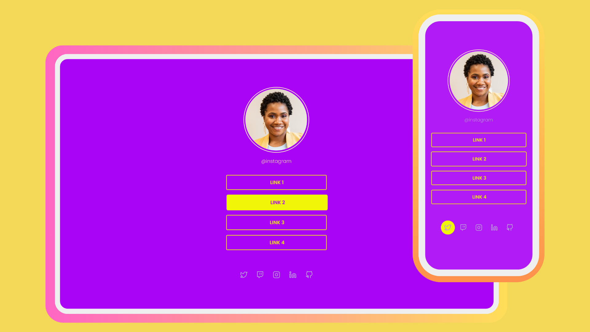

<h1 align="center"> DevLinks </h1>

Os projetos no portfólio têm a finalidade de aprimorar habilidades e conhecimento por meio de prática e estudo.

  <a href="#-tecnologias">Tecnologias</a>&nbsp;&nbsp;&nbsp;|&nbsp;&nbsp;&nbsp;
  <a href="#-projeto">Projeto</a>&nbsp;&nbsp;&nbsp;|&nbsp;&nbsp;&nbsp;
  <a href="#-layout">Layout</a>&nbsp;&nbsp;&nbsp;|&nbsp;&nbsp;&nbsp;
  <a href="#memo-licença">Licença</a>

  

 

  

## 🚀 Tecnologias

Esse projeto foi desenvolvido com as seguintes tecnologias:

- HTML e CSS
- Git e Github
- Canva
- Figma

## 💻 Projeto

Este projeto é uma página de links para redes sociais, perfeita para adicionar aos perfis de suas redes sociais. Ela permite que você compartilhe seus perfis e links importantes com seus seguidores de forma organizada. O projeto foi desenvolvido utilizando HTML e CSS para criar um layout atraente e responsivo.

## 🔖 Layout

- O layout foi projetado para ser limpo e atraente, garantindo uma experiência visual agradável para os visitantes.

- Os links são organizados de forma clara e intuitiva, facilitando a localização das redes sociais e sites relacionados.

- Cores e elementos visuais foram escolhidos para criar uma estética atraente que combine com perfis de redes sociais.

- Foram adicionadas animações hover para melhorar a experiência do usuário. Ao passar o mouse sobre os links, eles podem ter efeitos de destaque, como mudança de cor ou animações sutis.

## :memo: Licença

Esse projeto está sob a licença MIT.

---
